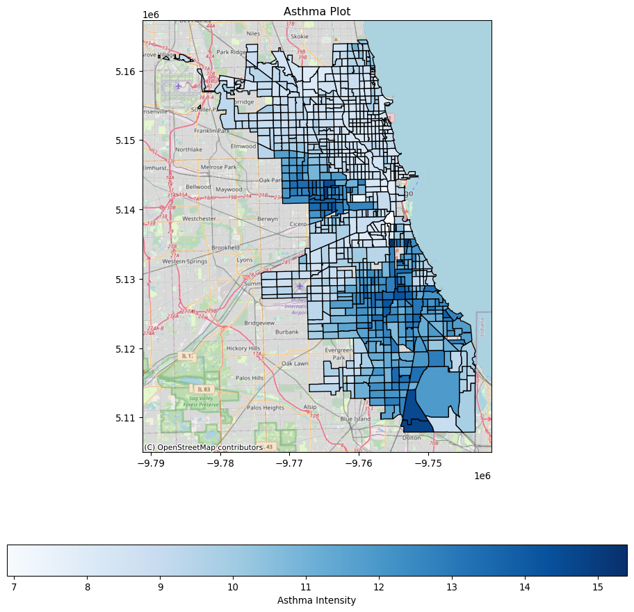
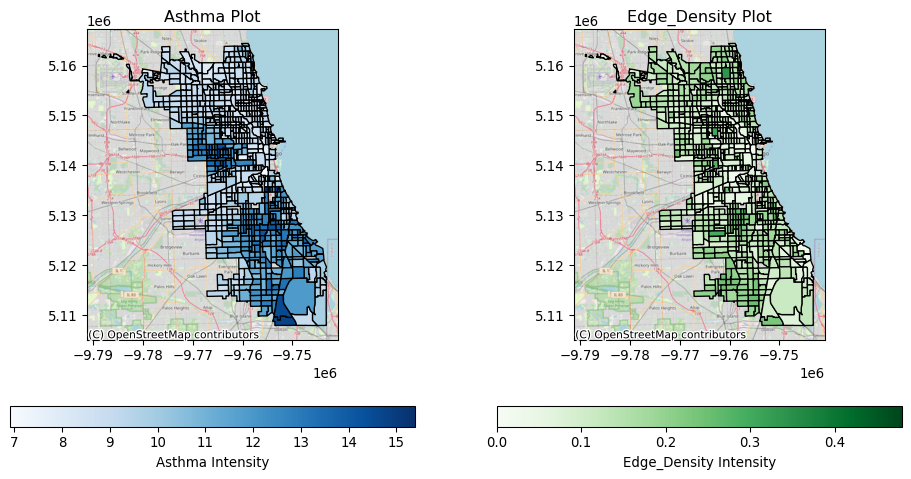
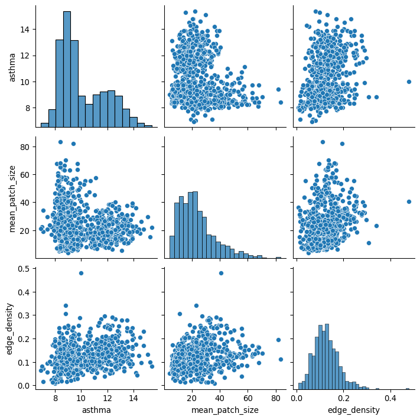
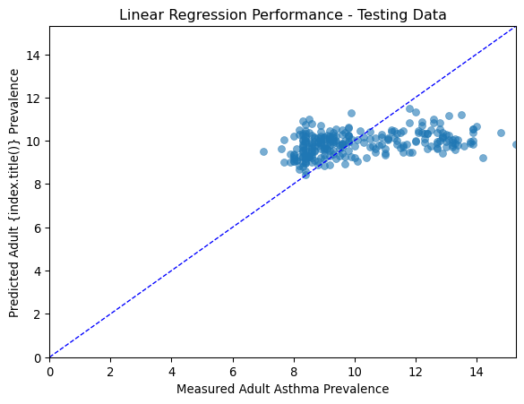
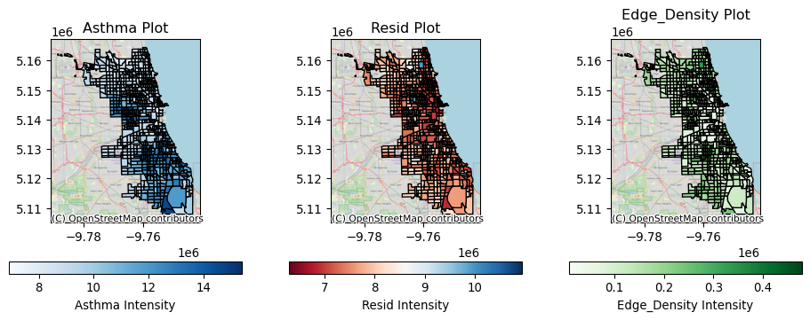

:::: {.cell execution_count="1"}
``` {.python .cell-code}
import sys
print(sys.executable)
print(sys.version)
```

::: {.cell-output .cell-output-stdout}
    /users/brianyandell/miniconda3/envs/earth-analytics-python/bin/python
    3.11.10 | packaged by conda-forge | (main, Oct 16 2024, 01:26:25) [Clang 17.0.6 ]
:::
::::

# Urban Greenspace and Asthma Prevalence

## Get Started with Big Data Pipelines

Vegetation has the potential to provide many ecosystem services in urban
areas, such as cleaner air and water and flood mitigation. However, the
results are mixed on relationships between a simple measurement of
vegetation cover (such as average NDVI, a measurement of vegetation
health) and human health. We do, however, find relationships between
landscape metrics that attempt to quantify the connectivity and
structure of greenspace and human health. These types of metrics include
mean patch size, edge density, and fragmentation.

Read More: Study by [Tsai et
al. 2019](https://doi.org/10.1007/s11252-018-0813-3) on the relationship
between edge density and life expectancy in Baltimore, MD. The authors
also discuss the influence of scale (e.g. the resolution of the imagery)
on these relationships, which is important for this case study.

In this notebook, you will write code to calculate patch, edge, and
fragmentation statistics about urban greenspace in Chicago. These
statistics should be reflective of the connectivity and spread of urban
greenspace, which are important for ecosystem function and access. You
will then use a linear model to identify statistically significant
correlations between the distribution of greenspace and health data
compiled by the US Center for Disease Control.

### Working with larger-than-memory (big) data

For this project, we are going to split up the green space (NDVI) data
by census tract, because this matches the human health data from the
CDC. If we were interested in the average NDVI at this spatial scale, we
could easily use a source of multispectral data like Landsat (30m) or
even MODIS (250m) without a noticeable impact on our results. However,
because we need to know more about the structure of green space within
each tract, we need higher resolution data. For that, we will access the
[National Agricultural Imagery Program
(NAIP)](https://naip-usdaonline.hub.arcgis.com/) data, which is taken
for the continental US every few years at 1m resolution. That's enough
to see individual trees and cars! The main purpose of the NAIP data is,
as the name suggests, agriculture. However, it's also a great source for
urban areas where lots is happening on a very small scale.

The NAIP data for the City of Chicago takes up about 20GB of space. This
amount of data is likely to crash your kernel if you try to load it all
in at once. It also would be inconvenient to store on your hard drive so
that you can load it in a bit at a time for analysis. Even if your are
using a computer that would be able to handle this amount of data,
imagine if you were analysing the entire United States over multiple
years!

To help with this problem, you will use cloud-based tools to calculate
your statistics instead of downloading rasters to your computer or
container. You can crop the data entirely in the cloud, thereby saving
on your memory and internet connection, using
[rioxarray](https://corteva.github.io).

### Check your work with testing!

This notebook does not have pre-built tests. You will need to write your
own test code to make sure everything is working the way that you want.
For many operations, this will be as simple as creating a plot to check
that all your data lines up spatially the way you were expecting, or
printing values as you go. However, if you don't test as you go, you are
likely to end up with intractable problems with the final code.

## STEP 1: Set up your analysis

Import necessary packages

-   Create **reproducible file paths** for your project file structure.
-   To use cloud-optimized
    [GeoTiffs](https://www.earthdata.nasa.gov/about/esdis/esco/standards-practices/geotiff),
    we recommend some settings to make sure your code does not get
    stopped by a momentary connection lapse -- see the code cell below.

::: {.cell execution_count="2"}
``` {.python .cell-code}
#pip install --quiet ~/Documents/GitHub/landmapy
```
:::

::: {.cell execution_count="3"}
``` {.python .cell-code}
from landmapy.initial import robust_code, create_data_dir
```
:::

::: {.cell execution_count="4"}
``` {.python .cell-code}
robust_code()
data_dir = create_data_dir('chicago-greenspace')
```
:::

## STEP 2: Create a site map

We use the [Center for Disease Control (CDC)
Places](https://www.cdc.gov/places) dataset for human health data to
compare with vegetation. CDC Places also provides some modified census
tracts, clipped to the city boundary, to go along with the health data.
We start by downloading the matching geographic data, and then select
the City of Chicago.

You can obtain urls for the U.S. Census Tract shapefiles from the [TIGER
service](https://www.census.gov/geographies/mapping-files/time-series/geo/tiger-line-file.html).
You'll notice that these URLs use the [state
FIPS](https://www.bls.gov/respondents/mwr/electronic-data-interchange/appendix-d-usps-state-abbreviations-and-fips-codes.htm),
which you can get installing and using the
[us](https://pypi.org/project/us/) package.

-   Download the Census tract Shapefile that goes along with CDC places
    -   `tract_path = shp_tract_path(data_dir, place='chicago-tract')`
    -   `chi_tract_gdf = download_census_tract(tract_path, placename='Chicago')`
-   Use a **conditional statement** to cache your download.
    -   `if not os.path.exists(tract_path):`
-   Use a **row filter** to select only the census tracts in Chicago
    -   `tract_gdf[tract_gdf.PlaceName == placename]`
-   Use a **spatial join** to select only the Census tracts that lie at
    least partially within the City of Chicago boundary.
    -   ***Not sure what this means.***

There is no need to cache the full dataset -- stick with your pared down
version containing only Chicago.

::: {.cell execution_count="5"}
``` {.python .cell-code}
from landmapy.cdcplaces import shp_tract_path, download_census_tract
```
:::

::: {.cell execution_count="6"}
``` {.python .cell-code}
# Set up the census tract path
tract_path = shp_tract_path(data_dir, 'chicago-tract')
chi_tract_gdf = download_census_tract(tract_path, 'Chicago')
```
:::

Code to save HV plot:

    import hvplot.pandas
    from landmapy.hvplot import hvplot_tract_gdf

    chi_tract_hv = hvplot_tract_gdf(chi_tract_gdf)
    hvplot.save(chi_tract_hv, "chi_tract.html")

**NOW NEED TO incorporate this image**

**Reflect and Respond**

What do you notice about the City of Chicago from the coarse satellite
image? Is green space evenly distributed? What can you learn about
Chicago from websites, scientific papers, or other resources that might
help explain what you see in the site map?

**WRITE YOUR CITY OF CHICAGO DATA DESCRIPTION AND CITATION HERE**

### Download census tracts and select your urban area

-   Download the Census tract Shapefile for the state of Illinois (IL).
-   Use a **conditional statement** to cache the download

## STEP 3: Access Asthma and Urban Greenspaces Data

### Access human health data

The U.S. Center for Disease Control (CDC) provides a number of health
variables through their [Places Dataset](https://www.cdc.gov/places/)
that might be correlated with urban greenspace. For this assignment,
start with adult asthma. Try to limit the data as much as possible for
download. Selecting the state and county is one way to do this.

-   Access Places data with an API, but as with many APIs it is easier
    to test out your search before building a URL. Navigate to the
    [Places Census Tract Data
    Portal](https://data.cdc.gov/500-Cities-Places/PLACES-Local-Data-for-Better-Health-Census-Tract-D)
    and search for the data you want.
-   The data portal will make an API call for you, but there is a
    simpler, easier to read and modify way to form an API call. Check
    out to the [socrata
    documentation](https://dev.socrata.com/docs/endpoints) to see how.
    You can also find some limited examples and a list of available
    parameters for this API on [CDC Places SODA Consumer API
    Documentation](https://dev.socrata.com/foundry/data.cdc.gov/cwsq-ngmh)
-   Once you have formed your query, you may notice that you have
    exactly 1000 rows. The Places SODA API limits you to 1000 records in
    a download. Either narrow your search or check out the `&$limit=`
    parameter to increase the number of rows downloaded. You can find
    more information on the [Paging page of the SODA API
    documentation](https://dev.socrata.com/docs/paging)
-   You should also clean up this data by renaming the `'data_value'` to
    something descriptive, and possibly selecting a subset of columns.

::: {.cell execution_count="7"}
``` {.python .cell-code}
from landmapy.cdcplaces import download_cdc_disease, join_tract_cdc
from landmapy.plot import plot_gdfs_map
from landmapy.naip import naip_path, download_naip_scenes, ndvi_naip_df
```
:::

:::: {.cell execution_count="8"}
``` {.python .cell-code}
# Preview asthma data
cdc_df = download_cdc_disease(data_dir, 'asthma')
cdc_df
```

::: {.cell-output .cell-output-display execution_count="24"}
<div>
<style scoped>
    .dataframe tbody tr th:only-of-type {
        vertical-align: middle;
    }

    .dataframe tbody tr th {
        vertical-align: top;
    }

    .dataframe thead th {
        text-align: right;
    }
</style>

         year   tract         asthma   asthma_ci_low   asthma_ci_high   data_value_unit   totalpopulation   totalpop18plus
  ------ ------ ------------- -------- --------------- ---------------- ----------------- ----------------- ----------------
  0      2022   17031031100   8.4      7.5             9.5              \%                4691              4359
  1      2022   17031031900   8.6      7.7             9.7              \%                2522              2143
  2      2022   17031062600   8.3      7.3             9.3              \%                2477              1760
  3      2022   17031070101   8.9      7.9             9.9              \%                4171              3912
  4      2022   17031081100   9.0      8.0             10.1             \%                4187              3951
  \...   \...   \...          \...     \...            \...             \...              \...              \...
  1323   2022   17031834900   13.5     12.1            15.0             \%                1952              1451
  1324   2022   17031828601   9.8      8.8             11.0             \%                4198              3227
  1325   2022   17031843700   8.4      7.5             9.5              \%                2544              1891
  1326   2022   17031829700   10.8     9.6             12.1             \%                3344              2524
  1327   2022   17031829100   10.2     9.1             11.5             \%                3512              2462

<p>1328 rows × 8 columns</p>
</div>
:::
::::

### Join health data with census tract boundaries

-   Join the census tract `GeoDataFrame` with the asthma prevalence
    `DataFrame` using the `.merge()` method.
-   You will need to change the data type of one of the merge columns to
    match, e.g. using `.astype('int64')`
-   There are a few census tracts in Chicago that do not have data. You
    should be able to confirm that they are not listed through the
    interactive Places Data Portal. However, if you have large chunks of
    the city missing, it may mean that you need to expand the record
    limit for your download.

:::: {.cell execution_count="9"}
``` {.python .cell-code}
tract_cdc_gdf = join_tract_cdc(chi_tract_gdf, cdc_df)
plot_gdfs_map(tract_cdc_gdf, column='asthma')
```

::: {.cell-output .cell-output-display}

:::
::::

**Reflect and Respond**

Write a description and citation for the asthma prevalence data. Do you
notice anything about the spatial distribution of asthma in Chicago?
From your research on the city, what might be some potential causes of
any patterns you see?

**ADD YOUR CDC PLACES DESCRIPTION AND CITATION HERE**

### Get NAIP Data URLs

NAIP data are freely available through the [Microsoft Planetary
Computer](https://planetarycomputer.microsoft.com/) [SpatioTemporal
Access Catalog (STAC)](https://stacspec.org/en).

-   Access planetary computer catalog via `pystac_client.Client.open()`
-   Loop across census tract to `.search()` for NAP data
    -   `collections=["naip"]`
    -   `intersects=shapely.to_geojson(tract_geometry)`
    -   `datetime=f"{year}"`
-   Access URL using `search.assets['image'].href`
-   Accumulate the urls in a `pd.DataFrame` or `dict` for later
-   Occasionally you may find that the STAC service is momentarily
    unavailable. You should include code that will retry the request up
    to 5 times when you get the `pystac_client.exceptions.APIError`

> **Warning**
>
> As always -- DO NOT try to write this loop all at once! Stick with one
> step at a time, making sure to test your work. You also probably want
> to add a `break` into your loop to stop the loop after a single
> iteration. This will help prevent long waits during debugging.

Download NAIP scenes if not done already. Might want special case if
some index values already downloaded.

::: {.cell execution_count="10"}
``` {.python .cell-code}
naip_index_path = naip_path(data_dir, 'chicago')    
%store -r chi_scenes_df
try:
    chi_scenes_df
except NameError:
    chi_scenes_df = download_naip_scenes(naip_index_path, tract_cdc_gdf)
    %store chi_scenes_df
```
:::

### Compute NDVI Index Statistics

Calculate some metrics to get at different aspects of the distribution
of greenspace in each census tract. These **fragmentation statistics**
can be implemented with the [scipy](https://scipy.org/) package. Some
examples include:

-   Percentage vegetation:\
    percent pixels that exceed a vegetation threshold (.12 is common
    with Landsat)
-   Patches: average size of **patches**, or contiguous area, exceeding
    the vegetation threshold. Patches can be identified with the `label`
    function from `scipy.ndimage`
-   Edges: proportion of edge pixels among vegetated pixels. Edges can
    be identified by **convolving** the image with a **kernel** designed
    to detect pixels that are different from their surroundings.

> **What is convolution?**
>
> Referring to differential equations, convolution is an approximation
> of the [Laplace
> transform](https://mathworld.wolfram.com/LaplaceTransform.html). For
> the purposes of calculating edge density, convolution means that we
> are taking all the possible 3x3 chunks for our image, and multiplying
> it by the kernel:
>
> $$
> \text{Kernel} =
> \begin{bmatrix}
> 1 & 1 & 1 \\
> 1 & -8 & 1 \\
> 1 & 1 & 1
> \end{bmatrix}
> $$
>
> The result is a matrix the same size as the original, minus the
> outermost edge. If the center pixel is the same as the surroundings,
> its value in the final matrix will be
> $-8 + 1 + 1 + 1 + 1 + 1 + 1 + 1 + 1 = 0$. If it is higher than the
> surroundings, the result will be negative, and if it is lower than the
> surroundings, the result will be positive. As such, the edge pixels of
> our patches will be negative.

-   Select census row(s)
    -   Select a single row from the census tract `GeoDataFrame` using
        e.g. `.loc[[0]]`.
    -   Select all the rows from your URL `DataFrame` that match the
        census tract.
-   For each URL, crop, merge, clip, and compute NDVI for that census
    tract.
-   Set a threshold to get a binary mask of vegetation.
-   Use sample code to compute the fragmentation statistics.

Feel free to add any other statistics you think are relevant, but make
sure to include a fraction vegetation, mean patch size, and edge
density.

### Repeat for all tracts

-   Using a loop, for each Census Tract:
    -   Using a loop, for each data URL:
        -   Use `rioxarray` to open up a connection to the STAC asset,
            just like you would a file on your computer
        -   Crop and then clip your data to the census tract boundary \>
            HINT: check out the `.clip_box` parameter `auto_expand` and
            the `clip` parameter `all_touched` to make sure you don't
            end up with an empty array
        -   Compute NDVI for the tract
    -   Merge the NDVI rasters
    -   Compute:
        -   total number of pixels within the tract
        -   fraction of pixels with an NDVI greater than .12 within the
            tract (and any other statistics you would like to look at)
    -   Accumulate the statistics in a file for later
-   Using a conditional statement, ensure that you do not run this
    computation if you have already saved values. You do not want to run
    this step many times, or have to restart from scratch! There are
    many approaches to this, but we actually recommend implementing your
    caching in the previous cell when you generate your dataframe of
    URLs, since that step can take a few minutes as well. However, the
    important thing to cache is the computation. Basically, URLs are
    saved via StoreMagic in `chi_scenes_df`, while NDVI computations are
    stored in CSV file at `naip_index_path`; after computations,
    `ndvi_naip_df()` (**need better name**) returns the `DataFrame`
    `ndvi_index_df`.

:::: {.cell execution_count="11"}
``` {.python .cell-code}
ndvi_index_df = ndvi_naip_df(naip_index_path, tract_cdc_gdf, chi_scenes_df)
```

::: {.cell-output .cell-output-display}
      0%|          | 0/788 [00:00<?, ?it/s]
:::
::::

## STEP 4: Explore your data with plots

### Chloropleth plots

Before running any statistical models on your data, check that your
download worked. You should see differences in both median income and
mean NDVI across the city.

Create a plot that contains:

-   2 side-by-side Chloropleth plots
-   Asthma prevelence on one and mean NDVI on the other
-   Make sure to include a title and labeled color bars

::: {.cell execution_count="12"}
``` {.python .cell-code}
from landmapy.naip import merge_ndvi_cdc
from landmapy.explore import var_trans, train_test
from landmapy.plot import plot_gdfs_map, plot_matrix, plot_train_test
```
:::

:::: {.cell execution_count="13"}
``` {.python .cell-code}
ndvi_cdc_gdf = merge_ndvi_cdc(tract_cdc_gdf, ndvi_index_df)
plot_gdfs_map(ndvi_cdc_gdf)
```

::: {.cell-output .cell-output-display}

:::
::::

Do you see any similarities in your plots? Do you think there is a
relationship between adult asthma and any of your vegetation statistics
in Chicago? Relate your visualization to the research you have done (the
context of your analysis) if applicable.

**ADD YOUR PLOT DESCRIPTION HERE**

## STEP 5: Explore a linear ordinary least-squares regression

### Model description

One way to find if there is a statistically significant relationship
between asthma prevalence and greenspace metrics is to run a linear
ordinary least squares (OLS) regression and measure how well it is able
to predict asthma given your chosen fragmentation statistics.

Before fitting an OLS regression, you should check that your data are
appropriate for the model.

Write a model description for the linear ordinary least-squares
regression that touches on:

-   What assumptions are made about the data?
-   What is the objective of this model?
-   What metrics could you use to evaluate the fit?
-   Advantages and potential problems with choosing this model.

**ADD YOUR CDC PLACES DESCRIPTION AND CITATION HERE**

### Data preparation

When fitting statistical models, you should make sure that your data
meet the model assumptions through a process of selection and/or
transformation. You can select data in various ways:

-   Eliminate observations (rows) or variables (columns) with missing
    data
-   Select model matching how variables are correlated
    -   linear models are not good at modeling circles
-   Select variables that explain most of variability in response

You can transform data:

-   transform while preserving order to better follow a bell shape
    (normal) or stabilize variance
    -   `log` to manage right skew
        [sklearn.preprocessing.PowerTransformer](https://scikit-learn.org/stable/modules/generated/sklearn.preprocessing.PowerTransformer.html)
    -   automated transformation choice schemes:
        [Box-Cox](https://www.geeksforgeeks.org/box-cox-transformation-using-python/)
        and [Bickel-Doksum](https://doi.org/10.2307/2287831)
    -   offset and/or rescale to overcome negative numbers or effects
        caused by different ranges (e.g. `log(x - min(x) + 1)` or
        `(x - min(x))/(max(x) - min(x))`)
-   dimension reduction (e.g. principle component analysis (PCA)) to
    reduce multicollinearity among the predictors

> **Tip**
>
> Keep in mind that data transforms like a log transform or a PCA must
> be reversed (or rescaled) after modeling for the results to be
> meaningful.

-   Use `hvplot.scatter_matrix()` to create an exploratory plot of data.
-   Adjust data to address issues with linear model assumptions.
-   Check for `NaN` values, and drop rows and/or columns. Use the
    `.dropna()` method to drop rows with `NaN` values.
-   Explain any data transformations or selections you made and why

:::: {.cell execution_count="14"}
``` {.python .cell-code}
logndvi_cdc_gdf = var_trans(ndvi_cdc_gdf)
plot_matrix(logndvi_cdc_gdf)
```

::: {.cell-output .cell-output-display}

:::
::::

**EXPLAIN YOUR SELECTION AND TRANSFORMATION PROCESS HERE**

### Fit and Predict

The [scikitlearn](https://scikit-learn.org/) library has a slightly
different approach than many software packages, emphasizing generic
model performance measures like cross-validation and importance over
coefficient p-values and correlation. The `scikitlearn` approach
generalizes more smoothly to machine learning (ML) models where the
statistical significance is harder to derive mathematically.

-   Use the `scikitlearn` documentation or ChatGPT as a starting point,
    split your data into training and testing datasets with
    [train_test_split()](https://scikit-learn.org/stable/modules/generated/sklearn.model_selection.train_test_split.html).
-   Fit a linear regression to your training data.
-   Use your fitted model to predict the testing values.
-   Plot the predicted values against the measured values. You can use
    the following plotting code as a starting point.

:::: {.cell execution_count="15"}
``` {.python .cell-code}
logndvi_cdc_test, reg, logndvi_cdc_gdf = train_test(logndvi_cdc_gdf)
plot_train_test(logndvi_cdc_test)
```

::: {.cell-output .cell-output-display}

:::
::::

### Spatial bias

We always need to think about bias, or systematic error, in model
results. Every model is going to have some error, but we'd like to see
that error evenly distributed. When the error is systematic, it can be
an indication that we are missing something important in the model.

In geographic data, we generally expect adjacent places to be more
similar than distant places ([spatial
autocorrelation](https://mgimond.github.io/Spatial/spatial-autocorrelation.html)).
Linear models can address location through trends (as part of expected
mean) or autocorrelation (as part of the variance-covariance structure).

-   Compute the model error (`predicted - measured`) for all census
    tracts
-   Plot the error as a chloropleth map with a diverging color scheme
-   Looking at both of your error plots, what do you notice? What are
    some possible explanations for any bias you see in your model?

:::: {.cell execution_count="16"}
``` {.python .cell-code}
plot_gdfs_map(logndvi_cdc_gdf, column=['asthma','resid','edge_density'], color=['Blues','RdBu','Greens'])
```

::: {.cell-output .cell-output-display}
{#fig-resid}
:::
::::

GeoViews code not shown:

    import holoviews as hv
    from landmapy.gvplot import gvplot_ndvi_index, gvplot_resid

    model_fit = gvplot_ndvi_index(ndvi_cdc_gdf)
    resid = gvplot_resid(logndvi_cdc_gdf, reg, yvar='asthma')
    models_gv = (model_fit[0] + resid + model_fit[1])
    hv.save(models_gv, 'bigdata_model.html')

**Reflect and Respond**

What do you notice about your model from looking at the error plots?
What additional data, transformations, or model type might help improve
your results?

## References

Tsai, Wei-Lun, Yu-Fai Leung, Melissa R. McHale, Myron F. Floyd, and
Brian J. Reich. 2019. "Relationships Between Urban Green Land Cover and
Human Health at Different Spatial Resolutions." Urban Ecosystems 22 (2):
315--24. <https://doi.org/10.1007/s11252-018-0813-3>.

Bickel PJ, Doksum K (1981) "An Analysis of Transformation Revisited"
JASA 76. <https://doi.org/10.2307/2287831>.

**DESCRIBE AND INTERPRET YOUR IMAGE HERE**
